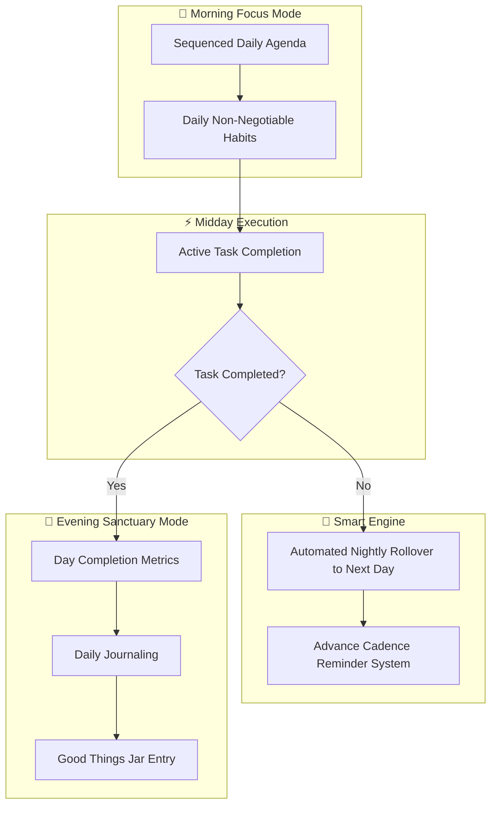

# UX Research & Product Vision Spec: Work-Study-Life Web Sanctuary

> **Project Phase:** Phase 1 — Narrative & Objectives  
> **Target Platform:** Responsive Web Application  
> **Core Persona:** Ages 18–40 (Students, Young Professionals & Multitaskers managing cognitive overload and burnout)

---

## 1. Executive Summary & Problem Space

### The Core Problem
Modern multitaskers (aged 18–40) constantly struggle with **context-switching fatigue**. When work, study, and personal responsibilities exist simultaneously without clear boundaries, users experience cognitive overload, forget critical personal care or deadlines, and suffer from persistent guilt and burnout.

### The Solution: "Morning Focus, Evening Sanctuary"
A holistic, responsive web application that acts as a structured command center by day and a calm reflection sanctuary by night. It bridges **structured task execution** with **emotional wellness**, ensuring incomplete items never get lost while providing a guilt-free end-of-day closure.

---

## 2. Primary User Persona & Empathy Map

### Persona Profile: *The Overwhelmed Multitasker*
* **Age Range:** 18–40 (NIFT/University students, creative professionals, young workers).
* **Key Traits:** High ambition, managing multi-track responsibilities, prone to decision fatigue.
* **Pain Points:** 
  * Overlap between personal errands and professional deadlines.
  * Forgetting micro-habits (e.g., soaking dry fruits, morning chia seeds).
  * Anxiety caused by seeing accumulating missed tasks.
  * Lack of a satisfying "end of day" stopping point.

### Multi-Sensory Empathy Map

| Life Stage | THINKS | FEELS | DOES | SAYS |
| :--- | :--- | :--- | :--- | :--- |
| **Morning (8 AM)** | *"What do I absolutely need to focus on first today without getting distracted?"* | Anxious, seeking clarity, eager to organize the chaos. | Opens the web app; checks sequenced daily targets; prepares micro-habits. | *"I need a clean list so I don't forget anything important."* |
| **Mid-Day (2 PM)** | *"Am I making progress? What's next on my schedule?"* | Busy, context-switching between work/study and personal care. | Crosses off completed tasks; receives gentle advance reminders. | *"Let me quickly tick this off before moving to the next assignment."* |
| **Evening (10 PM)** | *"Did I do enough today? I feel exhausted but want to unwind."* | Relieved, reflective, needing emotional closure and calm. | Triggers day closure; reviews completed tasks; writes journal entry; drops note into "Good Things Jar". | *"I accomplished a lot today. Time to log off and recharge."* |

---

## 3. Product Pillars & Smart Logic Rules

### Pillar Breakdown & Functional Requirements

#### Pillar 1: Sequenced Daily Agenda & Task Management
* **Morning View:** Displays a clear, ordered list of daily targets categorized by Work, Study, and Personal life.
* **Sequential Roadmap:** Eliminates clutter by emphasizing *what to do next*.

#### Pillar 2: Micro-Habits & Daily Non-Negotiables
* **Daily Ritual Tracker:** Dedicated section for recurring wellness habits (e.g., *"Drink chia seeds every morning"*, *"Soak dry fruits at night"*).
* **Time-Bound Anchors:** Categorized by morning launch vs. evening wind-down.

#### Pillar 3: Smart Rollover Engine & Advance Reminders
* **Automated Carrying Forward:** Unfinished tasks (e.g., *"Do laundry on 20th"*) automatically roll over to the 21st without punishing the user.
* **Advance Reminder Logic:** Custom notification triggers (e.g., 5-day advance warnings for upcoming milestones).

#### Pillar 4: Evening Reflection & Gratitude Vault
* **Day-End Closure:** A distinct UX transition at night showing overall progress and relaxing visual cues.
* **Daily Journal:** Space for freeform reflection, mood tracking, and thoughts.
* **Good Things Jar:** Interactive digital jar to collect wins, positive moments, and gratitude cards.

---

## 4. Key UX Principles

1. **Cognitive Load Reduction:** Show only what matters *now* based on time of day.
2. **Guilt-Free Productivity:** Automatic task carry-over replaces stress with seamless continuity.
3. **Tactile & Editorial Aesthetics:** Soft transitions, serene color schemes, and warm typography designed specifically for web browsers.
